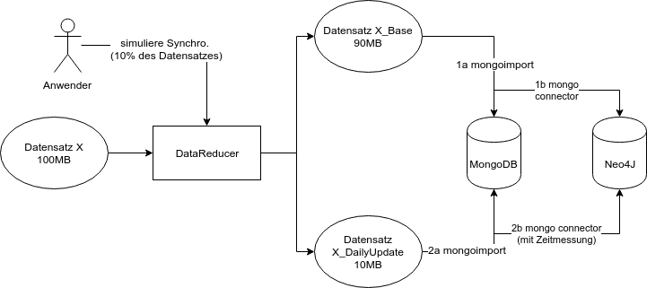

# Konzeptioneller Entwurf

Dieses Entwurfsdokument beschreibt konzeptionell den Ablauf, sowie die Architektur unter Einbeziehung der genutzten Frameworks von **PolyG-DBP** (Polyglot-Database Performance).

## Allgemeines Vorhaben
Wir widmen uns mit unserem Projekt dem Vergleich einer Graphdatenbank mit einer Dokumentendatenbank.

Unsere Software PolyG-DBP soll hierfür mithilfe von Benchmarking in der Lage sein, Aufschlüsse darüber geben zu können, wie sich die Struktur der Datenbank auf die Performanz auswirkt. Zu diesem Zweck soll die Dauer für das Ausführen gleicher Abfragen für den gleichen Datensatz auf ihnen verglichen werden.

Darüber hinaus soll ebenfalls das folgende Szenario betrachtet werden: Sofern eine Graphdatenbank gegenüber der Dokumentendatenbank bei bestimmten Abfragetypen deutlich performanter ist, lohnt sich die Bereitstellung einer Polyglot Anwendung, d.h. die Verwendung unterschiedlicher Datenbanksysteme trotz der damit notwendigen Synchronisation? Hierfür soll  PolyG-DBP ebenfalls Messmethoden bereitstellen. 

## Ablauf und Architektur

Die Software PolyG-DBP wird in Java als Konsolenapplikation umgesetzt.
Konkret werden **Neo4j** als Graphdatenbank und **MongoDB** als Dokumentendatenbank untersucht. Für ihre Synchronisation werden **mongo-connector** und **neo4j doc manager** verwendet.
Zum Testen der Abfragen benutzt PolyDBTesting den **Yelp Open Datensatz** [https://yelp.com/dataset](https://www.yelp.com/dataset).

Der Anwender kann beim Aufruf der Applikation mithilfe von Befehlszeilenparametern zwischen verschiedenen, vorgefertigten Abfragen an die Datenbanken (DB) wählen. Diese passen zum Yelp Datensatz und sind sowohl in der Mongo- und Neo4j-kompatiblen Abfragesprache vorgeschrieben. Desweiteren kann der Anwender wählen, ob der Datensatz in den DB bereits existiert, oder noch über PolyG-DBP vollständig/teilweise in die DB geladen werden sollen. Das optionale Kürzen der Datenmengen erfolgt über die Klasse *DataReducer* (siehe obige Abbildung) und gewährt einen schnelleren Performanztest. 

PolyG-DBP kümmert sich nach dem Aufruf um das Starten der DB und ggf. das Laden der Datensätze zunächst in die MongoDB mithilfe von mongoimport via *DatebaseServices*. Anschließend werden mongoconnector in Verbindung mit neo4j doc manager aufgerufen, um die Daten von MongoDB in die Neo4J DB zu laden. 

Um auf das obige Szenario vom allgemeinen Vorhaben einzugehen, kann der Anwender eine einmalige Synchronisation zwischen der MongoDB und Neo4J simulieren (siehe untere Abbildung). Hierzu wählt er einen Prozentsatz des Datensatzes, der als "Daily Update" fungiert. Dieser wird nach dem Grunddatensatz separat in die DB geladen. Die Dauer dieser Synchronisation wird zusätzlich gemessen (2b) und fungiert als Anhaltspunkt für die Kosten der Graphdatenbank neben einer Textdatenbank. 

Die Abfragen werden nun in der Klasse *QueryHandler*  mithilfe der Bibliotheken **Mongo-Java-Driver** und **Neo4j Java Driver** an die Datenbanken seriell weitergeleitet. Die Klasse *Benchmark* stoppt für das Ausführen der Abfragen und optional für die simulierte Synchronisation die Zeit.
Als Output erhält der Anwender ein Log und eine Konsolenausgabe mit den Ergebnissen.
